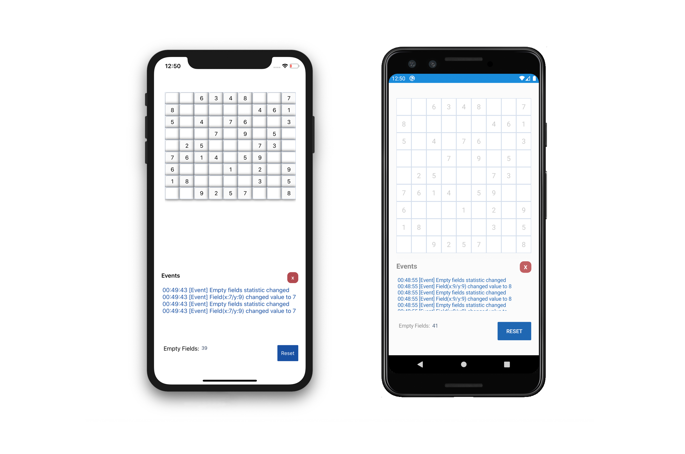

# Sudoku UI with Xamarin (MVVM)

## Tested Devices

__Android__

* Google Pixel (API 29 Q)
* Google Pixel 2 (API 28 Pie)
* Google Pixel 3 (API 29 Q)
* Samsung SM-G960F (API 28 Pie)

__iOS__

* iPhone 11 (iOS 1.32)
* iPad Pro (iOS 13.2)